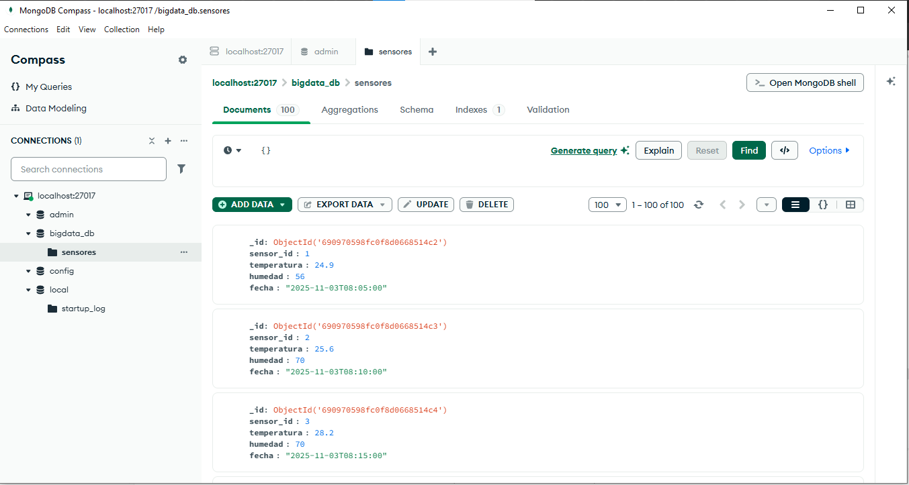
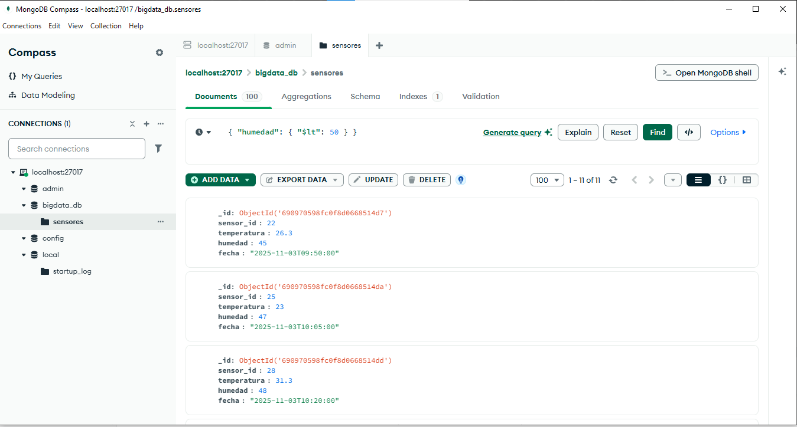
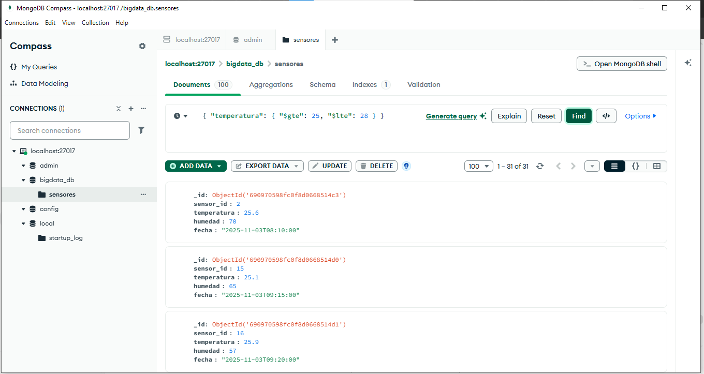
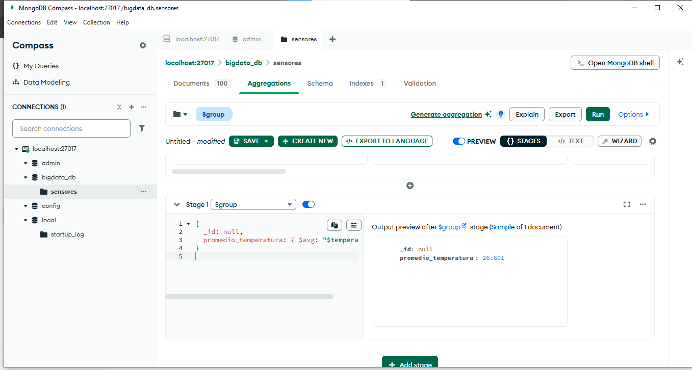
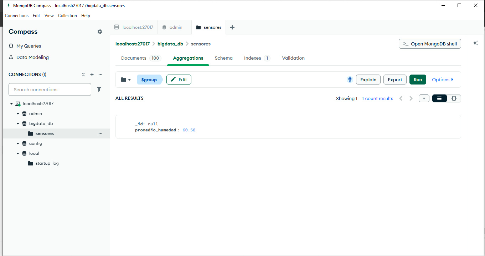
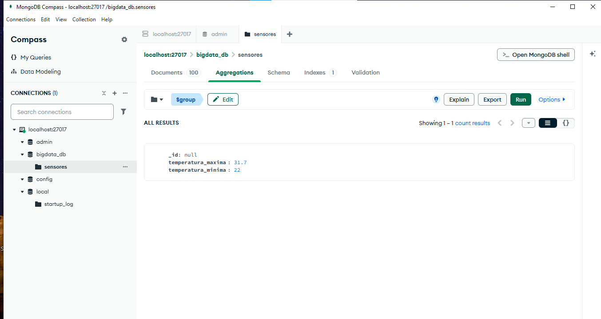

 Tarea 4 – Almacenamiento y Consultas de Datos en Big Data (MongoDB)
Autor: Jarlin Eduardo Álvarez Julio  
Curso:*Big Data  
Grupo: 202016911_10  
Tutor:Jaime Rubiano Llorente  
Universidad Nacional Abierta y a Distancia – UNAD (2025)  
 Descripción General
La actividad busca aplicar conceptos de almacenamiento, manipulación y análisis de datos en un entorno NoSQL.  
Se utilizó MongoDB Compass como herramienta para crear, cargar y analizar una base de datos denominada `bigdata_db`, con una colección llamada `sensores`.  

El caso de estudio representa un sistema de **monitoreo ambiental**, donde se registran lecturas de temperatura, humedad y fecha.  
El objetivo fue comprobar la eficiencia de MongoDB en la gestión de datos generados por dispositivos IoT.
 Fase 1 – Investigación: Tipos de Bases de Datos NoSQL

| Tipo de Base de Datos | Características | Ventajas | Limitaciones | Casos de Uso |
|------------------------|-----------------|-----------|---------------|--------------|
| Clave–Valor | Almacena información en pares clave y valor. | Rápida, ideal para almacenamiento temporal. | No maneja relaciones entre datos. | Redis, Memcached. |
| Documentos | Usa formatos JSON o BSON. | Flexible y escalable horizontalmente. | Puede ser ineficiente si los documentos son muy grandes. | MongoDB, CouchDB. |
| Columnar | Organiza datos por columnas. | Excelente para análisis masivo. | No apta para transacciones. | Cassandra, HBase. |
| Grafos | Representa nodos y conexiones. | Ideal para redes y relaciones. | Compleja de implementar. | Neo4j, OrientDB. |
Conclusión: 
Entre los diferentes tipos, MongoDB fue elegido por su estructura flexible, su compatibilidad con datos semiestructurados y su capacidad de integración en proyectos de Big Data.
Fase 2 – Implementación en MongoDB
 Diseño de la Base de Datos
- Base: `bigdata_db`  
- Colección: `sensores`  
- Campos:
  - `sensor_id` → Identificador numérico.  
  - `temperatura` → Valor de temperatura en °C.  
  - `humedad` → Porcentaje de humedad relativa.  
  - `fecha` → Fecha y hora de lectura.  
 Carga de Datos
Se insertaron 100 documentos JSON con lecturas simuladas de sensores:
```json
{
  "sensor_id": 1,
  "temperatura": 25.4,
  "humedad": 61,
  "fecha": "2025-11-03
Consultas realizadas 
1. Mostrar todos los documentos
```json
{}
Temperaturas mayores a 30 °C

{ "temperatura": { "$gt": 30 } }
3. Humedades menores al 50 %

{ "humedad": { "$lt": 50 } }


4. Temperaturas entre 25 °C y 28 °C

{ "temperatura": { "$gte": 25, "$lte": 28 } }


---

Consultas de Agregación

```markdown
Promedio de temperatura
```json
{
  "$group": {
    "_id": null,
    "promedio_temperatura": { "$avg": "$temperatura" }
  }
}


 Resultado: 26.6 °C

Promedio de humedad

{
  "$group": {
    "_id": null,
    "promedio_humedad": { "$avg": "$humedad" }
  }
}


 Resultado: 60.5 %

Temperatura máxima y mínima

{
  "$group": {
    "_id": null,
    "temperatura_maxima": { "$max": "$temperatura" },
    "temperatura_minima": { "$min": "$temperatura" }
  }
}


Resultado: Máx: 31.7 °C / Mín: 22 °C


---

Análisis de Resultados
## 📸 Evidencias en MongoDB Compass

A continuación se presentan las capturas de las consultas y operaciones realizadas en MongoDB Compass:

1. **Consulta 1:** Mostrar todos los registros  
   

2. **Consulta 2:** Temperaturas mayores a 30 °C  
   

3. **Consulta 3:** Humedad menor al 50 %  
   

4. **Agregación 1:** Temperatura entre 25 °C y 28 °C  
   

5. **Agregación 2:** Promedio de temperatura  
   

6. **Agregación 3:** Promedio de humedad  
   

7. **Agregación 4:** Cálculo de valores máximo y mínimo  
   


La base de datos permitió evidenciar cómo MongoDB facilita el análisis de datos semiestructurados mediante operaciones de agregación.  
Se logró calcular valores promedio, máximo y mínimo, demostrando la potencia de este sistema NoSQL para aplicaciones de IoT y Big Data.  
Los resultados obtenidos reflejan estabilidad en las mediciones de los sensores y validan la eficacia de las consultas realizadas.

---

Referencias

- Miranda, A., Oña, P., Mendoza, K., & Chango, W. (2023). *Evaluación comparativa de bases de datos NoSQL: clave/valor en un entorno de creaciones de aplicaciones.* ESPOCH Congresses, 3(2), 129–142.  
- Sarasa, A. (2016). *Introducción a las bases de datos NoSQL usando MongoDB.*  
- Gutiérrez Hernández, N. I., & Ibarra Limas, E. (2024). *Base de Datos para Proyectos de Big Data.* Congreso Internacional de Investigación Academia Journals.  

---

 Reflexión Personal

Durante el desarrollo de esta actividad logré afianzar mis conocimientos sobre el uso de bases de datos NoSQL y su aplicación en entornos de Big Data. La implementación en MongoDB me permitió comprender cómo almacenar, filtrar y analizar grandes volúmenes de información de forma estructurada y eficiente.  

A través de MongoDB Compass pude visualizar los datos en tiempo real, aplicar consultas con operadores y realizar operaciones de agregación, lo que facilitó el análisis y comprensión del comportamiento de los registros.  

Esta práctica fortaleció mis habilidades técnicas en el manejo de datos semiestructurados y reafirmó la importancia de las herramientas NoSQL en los proyectos modernos de análisis de información. Considero que este aprendizaje será de gran utilidad para futuros proyectos académicos y profesionales relacionados con el procesamiento y análisis de datos.

